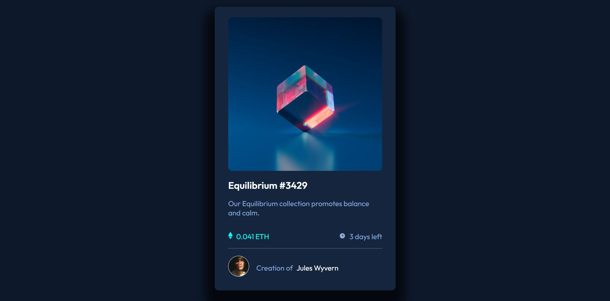

# Frontend Mentor - NFT preview card component solution

This is a solution to the [NFT preview card component challenge on Frontend Mentor](https://www.frontendmentor.io/challenges/nft-preview-card-component-SbdUL_w0U). Frontend Mentor challenges help you improve your coding skills by building realistic projects. 

## Table of contents

- [Overview](#overview)
  - [The challenge](#the-challenge)
  - [Screenshot](#screenshot)
- [My process](#my-process)
  - [Built with](#built-with)
  - [What I learned](#what-i-learned)
- [Author](#author)


## Overview

### The challenge

Users should be able to:

- View the optimal layout depending on their device's screen size


### Screenshot




## My process

### Built with

- HTML
- CSS
- Flexbox
- CSS Grid


### What I learned

How to implement a box shadow


```css
main {
  box-shadow: -1px 28px 28px 23px rgba(0, 0, 0, 0.73);
}
```


## Author

- Site - [Github Pages](https://saves42.github.io/nft_preview_card/)
- Twitter - [@saves_42](https://www.twitter.com/saves_42)

